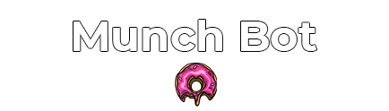

<div align="center">
  <p>
    
  </p>
  <strong>Market data and general information at your fingertips</strong>
</div>
<br/>
<hr />

## About

Munchy is a Discord bot that assists the Munch Donaton Project's official Discord server.
<br/>
For comments and support contact me on Discord: <strong>dxnter#0001</strong>

## 🚀 Getting Started

### Requirements

- [Discord Bot Token](https://github.com/reactiflux/discord-irc/wiki/Creating-a-discord-bot-&-getting-a-token)
- [Discord User ID](https://support.discord.com/hc/en-us/articles/206346498-Where-can-I-find-my-User-Server-Message-ID-)

### Installation

```bash
# Clone the repository
git clone https://github.com/dxnter/munchy

# Enter into the directory
cd munchy

# Install dependencies
npm install
```

### Configuration

Rename `config.example.json` to `config.json` in the root directory and enter in the correct information for each property.

`OWNERS` can either be a single Discord User ID or multiple ID's separated by a comma. Owners will have complete control over Lasty and bypass command throttling.

```json
{
  "OWNERS": "",
  "DISCORD_BOT_TOKEN": "",
  "LASTFM_API_KEY": ""
}
```

### Starting the bot

```bash
npm start
```
